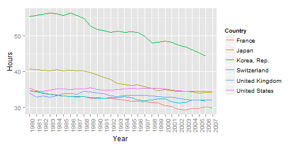
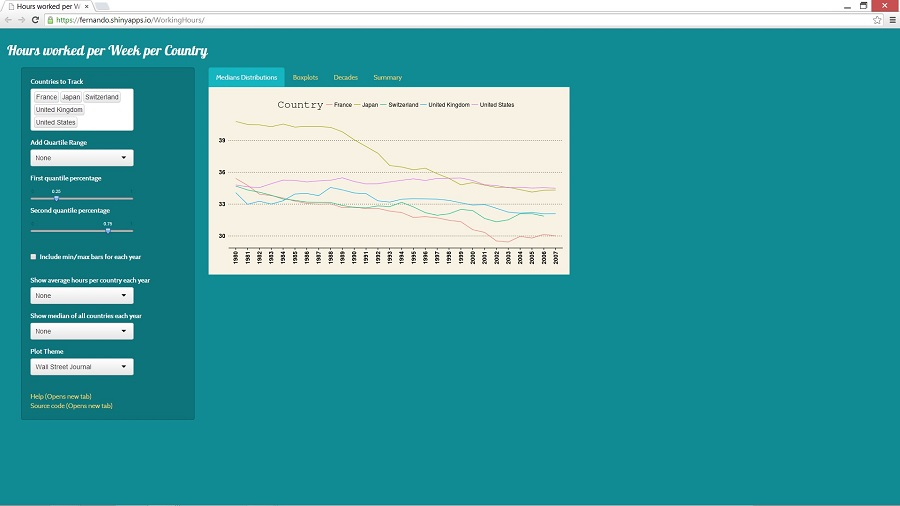

## Overview

Organizations like the Employment and Labour Market Policies Branch collect, track, and analyze country employment diagnostics to help in developing policies.

Looking at so much data in spreadsheets and tables can make it hard to quickly see trends or compare statistics. 
In addition to this, getting this information in a form in which statistics can be run quickly takes specific knowledge of programming languages (in this case the R langauge.)


```r
hours<- fread("hours_per_week.csv", header = TRUE, drop = 30) 
setnames(hours,"Working hours per week", "Country") 
hoursLong<- melt(hours, id = c("Country"), value.name = "Hours", variable.name = "Year" )
hoursLong$Decade<- cut2(as.numeric(as.character(hoursLong$Year)), cuts = c(1980, 1990, 2000))
hoursLong$Decade<- factor(hoursLong$Decade, labels = c("1980 - 1989", "1990 - 1999", "2000 - 2007"))
CountryStats<- ddply(hoursLong, .(Country, Decade), summarise,
                     median = round(median(Hours, na.rm = TRUE), 2),
                     mean = round(mean(Hours, na.rm = TRUE), 2),
                     lower = round(quantile(Hours, na.rm = TRUE, probs = 0.25), 2),
                     upper = round(quantile(Hours, na.rm = TRUE, probs = 0.75), 2))
HoursOrdered<- transform(CountryStats, Country = reorder(Country, -mean))
```


---

## Interpreting statistics

Even once statstics are run, information in tables are hard to explore intuitively, even moreseo when you want to compare subsets of the data on the fly, such as comparing only specific countries quickly.


```r
head(hoursLong, n = 3)
```

```
##      Country Year Hours      Decade
## 1: Argentina 1980    NA 1980 - 1989
## 2: Australia 1980 34.58 1980 - 1989
## 3:   Austria 1980    NA 1980 - 1989
```

```r
tail(HoursOrdered, n = 3)
```

```
##       Country      Decade median  mean lower upper
## 157 Venezuela 1980 - 1989     NA   NaN    NA    NA
## 158 Venezuela 1990 - 1999  32.85 32.85 32.51 33.18
## 159 Venezuela 2000 - 2007     NA   NaN    NA    NA
```

---

## Visualizing Statistics - The easy way

This app intends to make exploring this "Hours Worked Per Country" dataset easy to explore without the need for any specific programming experience, knowledge, or programs.

Dynamic versions of the following commands are running depending on point-and-click GUI input. Input such as countries being tracked can be dynamically changed at any time. All calculations are run on original csv's and can easily be extended to new time series data.

```r
ggplot(subset(hoursLong, Country %in% c("Switzerland", "United States", "Japan", "United Kingdom", "France", "Korea, Rep.")), 
       aes(x = Year, y = Hours)) + geom_line(aes(color = Country, group = Country)) + theme(axis.text.x = element_text(angle = 90))
```

 

---
## Interface Example
Dynamic inputs for making custom visualizations with custom themes available.

  

---
## More visualizations and data

Boxplots, decade breakdown visualizations, and summary statistics are all in separate tabs, and downloadable as png files.

So go ahead and try it now!

- https://fernando.shinyapps.io/WorkingHours/

Data courtesy of Gapminder and International Labour Organization
- http://www.gapminder.org/data/
- https://github.com/FCH808/GapminderHoursWorked
